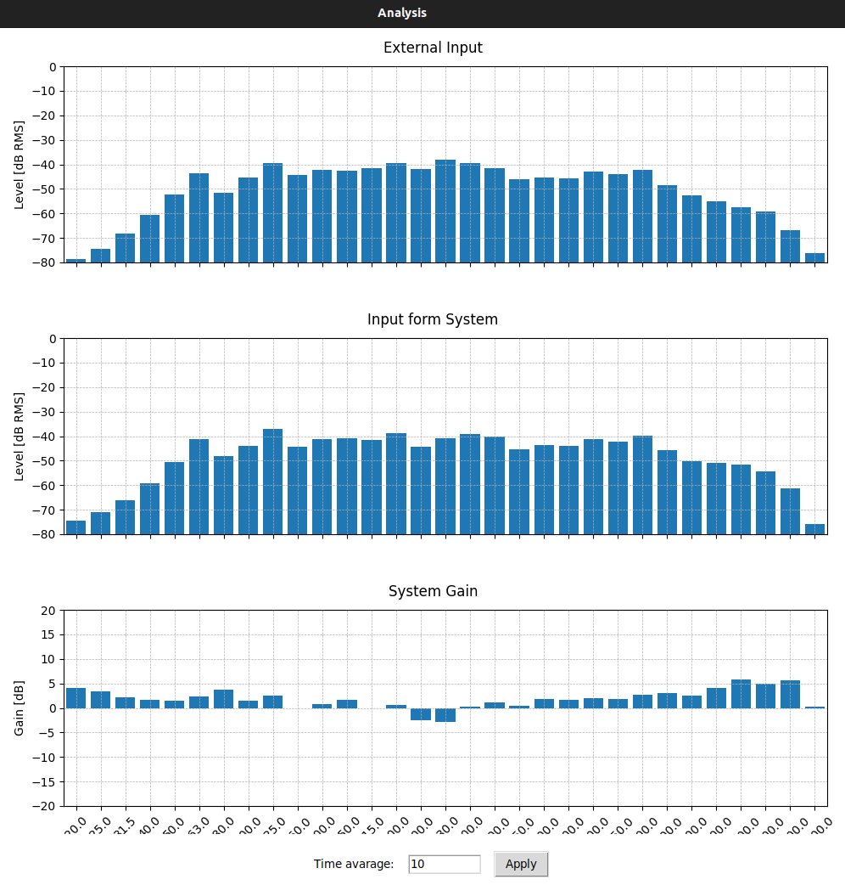
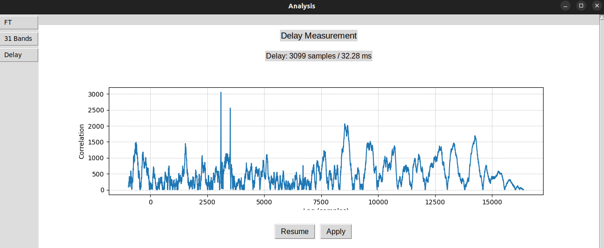
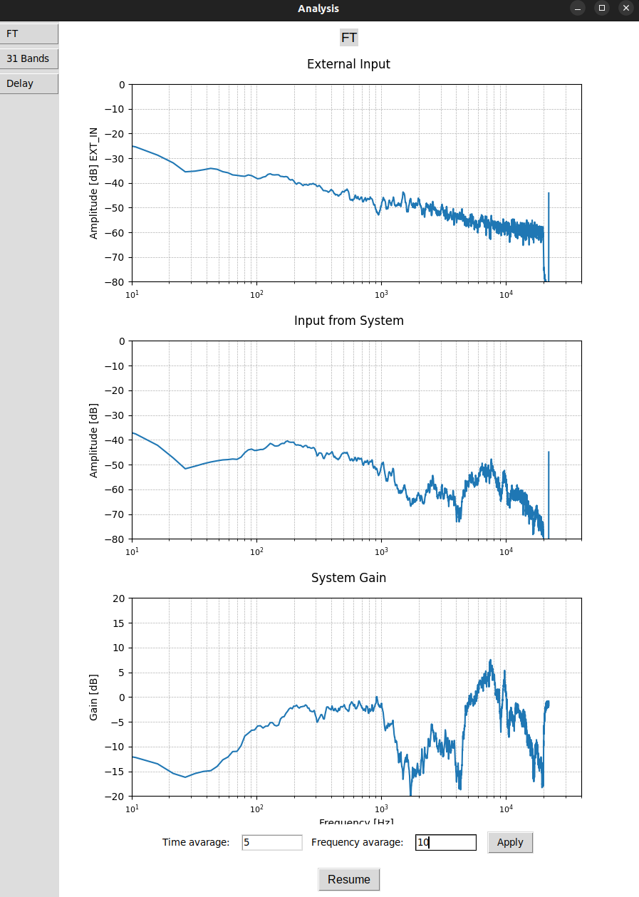
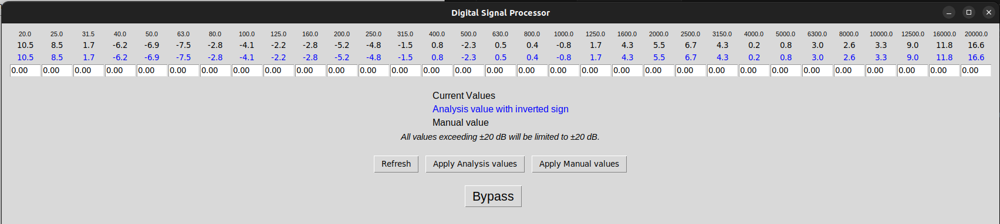
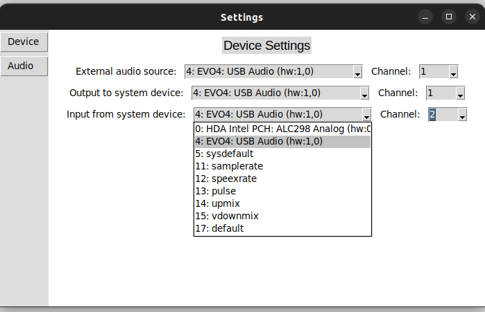
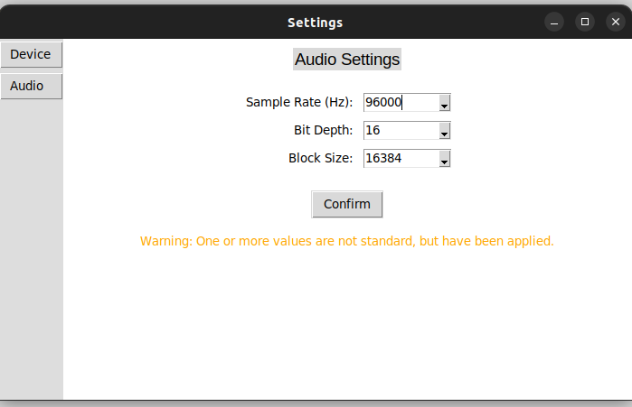

# RTA+C  
## Real-Time Analysis plus Correction

This repository contains a final degree project, completed in 2025, and released under a [Creative Commons Attribution-ShareAlike (CC BY-SA) license](https://bibliotecnica.upc.edu/en/propietat-intellectual/llicencies-acces-lliure-creative-commons-gnu), focused on developing a software-based solution for real-time analysis and correction of acoustic environments.

The license terms are available in the `LICENSE.txt` file.

### Abstract

This project addresses a common challenge faced by audio engineers and technicians: adjusting sound systems
based on the acoustic properties of a given environment. While there are existing commercial solutions that
offer advanced analysis tools, this work proposes the development of a custom, software-based alternative using
open-source technologies.

The proposed solution is implemented in Python and designed to perform real-time acoustic analysis and
correction. It integrates several scientific libraries, including NumPy and SciPy for signal processing, and
uses Sounddevice for real-time audio input and output. The program interacts with the environment through a
basic hardware setup consisting of a microphone, a speaker, and a sound card.

A graphical user interface is developed using Tkinter and Matplotlib to ensure usability and ease of interaction.
This graphical user interface allows users to configure audio parameters, select input channels, visualize data,
and monitor system behavior in real time. Features include Fourier transformation, filter-based processing,
and measurement tools such as delay, phase, and frequency response analysis.

Throughout the development, special attention is given to flexibility and accessibility. The software is intended
to run on standard hardware under Linux (specifically Ubuntu 22.04.5 LTS), making it usable in both
professional and home studio environments.

Finally, the project reflects on the difficulties encountered during development, acknowledging that not all
objectives have been fully achieved. It discusses the main technical and practical challenges, and offers
constructive criticism to guide future iterations. Despite these limitations, the result is a solid foundation on
which to build. While the tool is not yet fully functional, it provides a working base from which the missing
features can be implemented and the existing ones improved.

### Screenshots

Below are some screenshots of the graphical user interface and available features:

#### RTA Tool

#### Delay Measurement Tool

#### FT Analysis Tool

#### DSP Module with 31-Band Equalizer

#### Device Settings

#### Audio and Device Settings

*Note: These screenshots are intended to give a quick visual overview. For detailed explanations, refer to the report.*

### Repository Structure

- `README.md` – This file.
- `report.pdf` – Final project report.
- `program/` – Python source code implementing the software.
- `program/old_versions/` – Archived old versions of the source code.
- `report_src/` – LaTeX source code and resources used to write the report.

### Work in Detail

For information about how to use the software in practice, refer to the __Final Test__ section of the __Results__ chapter in the report.

For a more in-depth explanation of how the source code is structured and how it works, it is recommended to read the __Development of the Proposed Solution__ chapter of the report.

To better understand the current limitations and planned future improvements, refer to the first two sections of the __Results__ chapter (__Drawbacks__ and __Advantages__).
